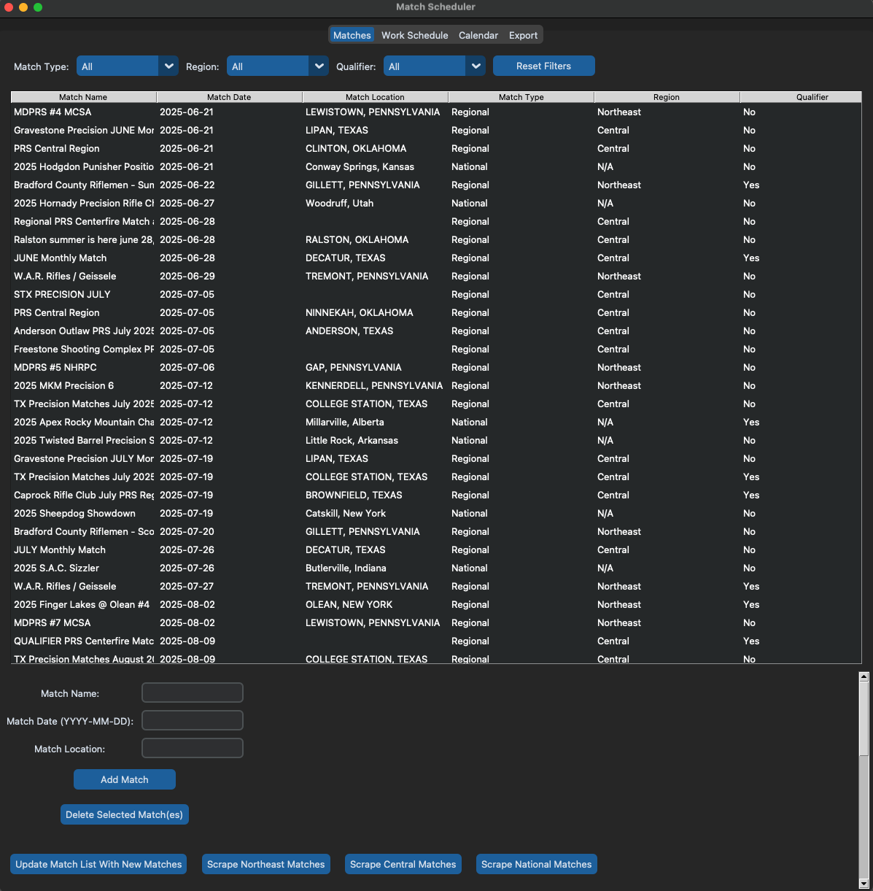
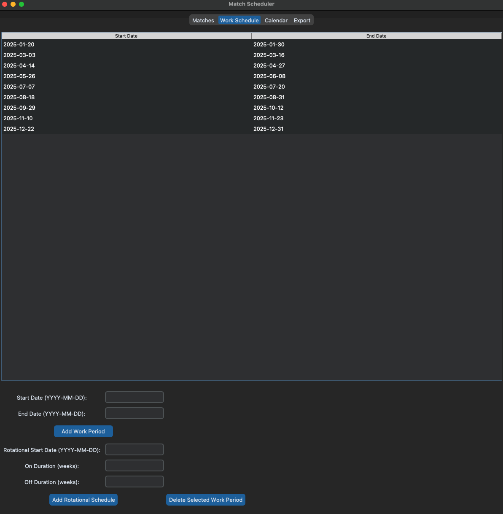
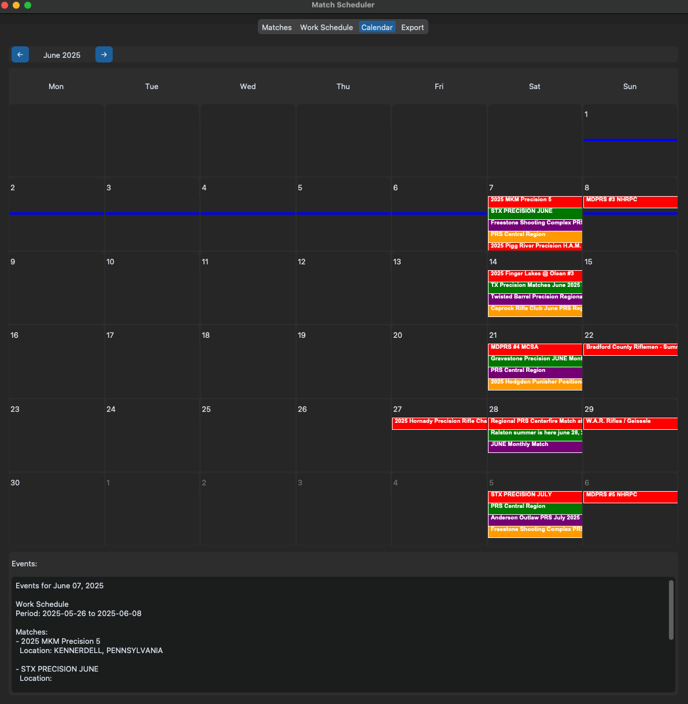

# Match Scheduler Application

The Match Scheduler Application is a Python-based desktop application designed to help users manage shooting match schedules and work periods. It provides features for scraping match data, filtering matches, managing work schedules, and exporting calendars to PDF.

## Features

- **Match Management**:
  - Add, delete, and filter matches by type, region, and qualifier status.
  - Scrape match data from regional and national websites using Playwright.
  - Prevent duplicate matches and exclude past matches.

- **Work Schedule Management**:
  - Add manual work periods or rotational schedules.
  - Delete selected work periods.

- **Calendar View**:
  - View matches and work periods in a monthly calendar format.
  - Navigate between months and view detailed events for specific days.

- **Export to PDF**:
  - Export the calendar and match details to a PDF file.

## Installation

1. Clone the repository:
   ```bash
   git clone <repository-url>
   cd <repository-folder>
   ```

2. Install dependencies:
   ```bash
   pip install -r requirements.txt
   ```

3. Install Playwright:
   ```bash
   playwright install
   ```

## Usage

1. Run the application:
   ```bash
   python main.py
   ```

2. Use the tabs to manage matches, work schedules, and view the calendar.

3. Scrape match data using the buttons in the "Matches" tab.

4. Export the calendar to PDF using the "Export" tab.

## File Structure

- `main.py`: Main application code.
- `matches.json`: Stores match data.
- `work_schedule.json`: Stores work schedule data.
- `requirements.txt`: Lists Python dependencies.

## Dependencies

- `customtkinter`: For the application's UI.
- `fpdf`: For PDF generation.
- `tkcalendar`: For calendar functionality.
- `pillow`: For image processing.
- `playwright`: For web scraping.

## License

This project is licensed under the MIT License.

## Screenshots

### Matches Tab 


### Work Schedule Tab


### Calendar Tab


## Contributing

Contributions are welcome! Please submit a pull request or open an issue for any bugs or feature requests.

## Contact

For questions or support, please contact nick.fornicola@gmail.com
